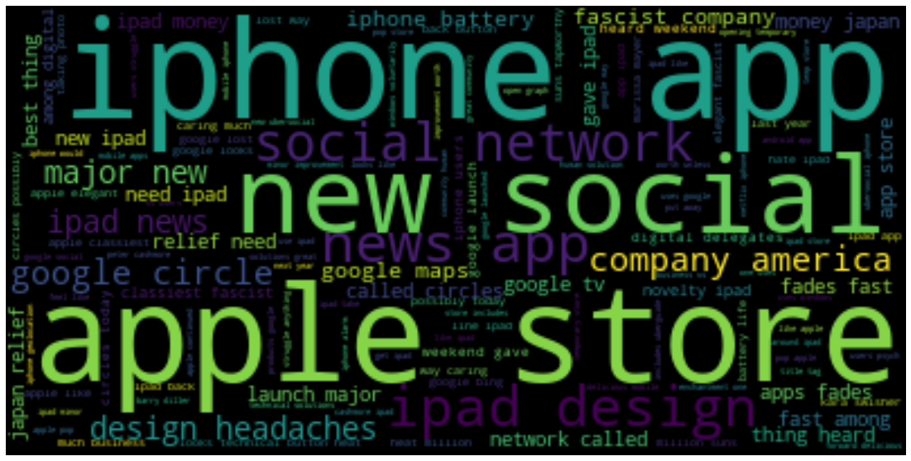
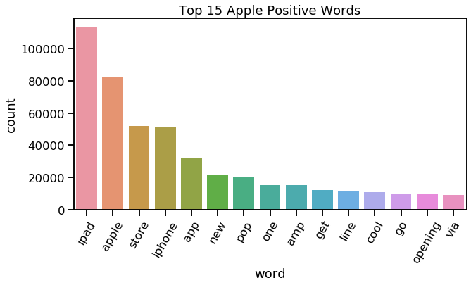

# Project 4: NLP - Sentiment Analysis
 Jamaal Smith<br>
 Flatiron School <br>
 [Video Walkthrough of PowerPoint](https://www.youtube.com/channel/UCoq5xP_nSnfo-GxediakXUQ/videos?view=0&sort=dd&shelf_id=0).

## Introduction

Sentiment Analysis is a useful tool within the Natural Language Processing domain that enables organizations to get a sense how the public is responding to their brand. In this analysis, I will perform such an analysis on a set of tweets from [data.world.](https://data.world/crowdflower/brands-and-product-emotions).

Through analysis of these tweets, I hope to learn the context with which Apple and Google are being compared in these tweets. By this, are these tweets all from a single point in time such as a product release. I also believe analysis of the tweets can provide context as to the tweet's audience base. Finally, this analysis can also provide useful insights into how the brand with lesser social media on clout might be able to revamp their image to drive the sort of customer engagement that they desire.

# Obtaining Data


```python
import pandas as pd
import numpy as np
import re
import string
from nltk.corpus import stopwords
from nltk.tokenize import word_tokenize
from sklearn.feature_extraction.text import TfidfVectorizer
from sklearn.model_selection import train_test_split
from nltk.stem import PorterStemmer
from nltk.stem import WordNetLemmatizer
import matplotlib.pyplot as plt
from PIL import Image
from wordcloud import WordCloud, STOPWORDS, ImageColorGenerator
import seaborn as sns
from IPython.display import IFrame
from IPython.core.display import display, HTML
display(HTML("<style>.container { width:98% !important; }</style>"))

# ML Libraries
from sklearn.metrics import accuracy_score
from sklearn.naive_bayes import MultinomialNB
sns.set_context('talk')
```


<style>.container { width:98% !important; }</style>


```python
data = pd.read_csv('data.csv',encoding='utf-8')
data = data.astype(str)
tweets = pd.DataFrame(data['tweet_text'])
```

## Scrubbing/Cleaning Data

### DataFrame treatment


```python
#preview of data
data.head(10)
```


<div>
<style scoped>
    .dataframe tbody tr th:only-of-type {
        vertical-align: middle;
    }

    .dataframe tbody tr th {
        vertical-align: top;
    }

    .dataframe thead th {
        text-align: right;
    }
</style>
<table border="1" class="dataframe">
  <thead>
    <tr style="text-align: right;">
      <th></th>
      <th>tweet_text</th>
      <th>emotion_in_tweet_is_directed_at</th>
      <th>is_there_an_emotion_directed_at_a_brand_or_product</th>
    </tr>
  </thead>
  <tbody>
    <tr>
      <td>0</td>
      <td>.@wesley83 I have a 3G iPhone. After 3 hrs twe...</td>
      <td>iPhone</td>
      <td>Negative emotion</td>
    </tr>
    <tr>
      <td>1</td>
      <td>@jessedee Know about @fludapp ? Awesome iPad/i...</td>
      <td>iPad or iPhone App</td>
      <td>Positive emotion</td>
    </tr>
    <tr>
      <td>2</td>
      <td>@swonderlin Can not wait for #iPad 2 also. The...</td>
      <td>iPad</td>
      <td>Positive emotion</td>
    </tr>
    <tr>
      <td>3</td>
      <td>@sxsw I hope this year's festival isn't as cra...</td>
      <td>iPad or iPhone App</td>
      <td>Negative emotion</td>
    </tr>
    <tr>
      <td>4</td>
      <td>@sxtxstate great stuff on Fri #SXSW: Marissa M...</td>
      <td>Google</td>
      <td>Positive emotion</td>
    </tr>
    <tr>
      <td>5</td>
      <td>@teachntech00 New iPad Apps For #SpeechTherapy...</td>
      <td>nan</td>
      <td>No emotion toward brand or product</td>
    </tr>
    <tr>
      <td>6</td>
      <td>nan</td>
      <td>nan</td>
      <td>No emotion toward brand or product</td>
    </tr>
    <tr>
      <td>7</td>
      <td>#SXSW is just starting, #CTIA is around the co...</td>
      <td>Android</td>
      <td>Positive emotion</td>
    </tr>
    <tr>
      <td>8</td>
      <td>Beautifully smart and simple idea RT @madebyma...</td>
      <td>iPad or iPhone App</td>
      <td>Positive emotion</td>
    </tr>
    <tr>
      <td>9</td>
      <td>Counting down the days to #sxsw plus strong Ca...</td>
      <td>Apple</td>
      <td>Positive emotion</td>
    </tr>
  </tbody>
</table>
</div>


```python
#stats on data
data.describe()
```


<div>
<style scoped>
    .dataframe tbody tr th:only-of-type {
        vertical-align: middle;
    }

    .dataframe tbody tr th {
        vertical-align: top;
    }

    .dataframe thead th {
        text-align: right;
    }
</style>
<table border="1" class="dataframe">
  <thead>
    <tr style="text-align: right;">
      <th></th>
      <th>tweet_text</th>
      <th>emotion_in_tweet_is_directed_at</th>
      <th>is_there_an_emotion_directed_at_a_brand_or_product</th>
    </tr>
  </thead>
  <tbody>
    <tr>
      <td>count</td>
      <td>9288</td>
      <td>9288</td>
      <td>9288</td>
    </tr>
    <tr>
      <td>unique</td>
      <td>9168</td>
      <td>10</td>
      <td>5</td>
    </tr>
    <tr>
      <td>top</td>
      <td>nan</td>
      <td>nan</td>
      <td>No emotion toward brand or product</td>
    </tr>
    <tr>
      <td>freq</td>
      <td>27</td>
      <td>5997</td>
      <td>5389</td>
    </tr>
  </tbody>
</table>
</div>


```python
# Dropping NANs
indexNames = data[data['emotion_in_tweet_is_directed_at'] == 'nan' ].index
# Delete these row indexes from dataFrame
data.drop(indexNames , inplace=True)

data.dropna()

```


<div>
<style scoped>
    .dataframe tbody tr th:only-of-type {
        vertical-align: middle;
    }

    .dataframe tbody tr th {
        vertical-align: top;
    }

    .dataframe thead th {
        text-align: right;
    }
</style>
<table border="1" class="dataframe">
  <thead>
    <tr style="text-align: right;">
      <th></th>
      <th>tweet_text</th>
      <th>emotion_in_tweet_is_directed_at</th>
      <th>is_there_an_emotion_directed_at_a_brand_or_product</th>
    </tr>
  </thead>
  <tbody>
    <tr>
      <td>0</td>
      <td>.@wesley83 I have a 3G iPhone. After 3 hrs twe...</td>
      <td>iPhone</td>
      <td>Negative emotion</td>
    </tr>
    <tr>
      <td>1</td>
      <td>@jessedee Know about @fludapp ? Awesome iPad/i...</td>
      <td>iPad or iPhone App</td>
      <td>Positive emotion</td>
    </tr>
    <tr>
      <td>2</td>
      <td>@swonderlin Can not wait for #iPad 2 also. The...</td>
      <td>iPad</td>
      <td>Positive emotion</td>
    </tr>
    <tr>
      <td>3</td>
      <td>@sxsw I hope this year's festival isn't as cra...</td>
      <td>iPad or iPhone App</td>
      <td>Negative emotion</td>
    </tr>
    <tr>
      <td>4</td>
      <td>@sxtxstate great stuff on Fri #SXSW: Marissa M...</td>
      <td>Google</td>
      <td>Positive emotion</td>
    </tr>
    <tr>
      <td>...</td>
      <td>...</td>
      <td>...</td>
      <td>...</td>
    </tr>
    <tr>
      <td>9272</td>
      <td>@mention your PR guy just convinced me to swit...</td>
      <td>iPhone</td>
      <td>Positive emotion</td>
    </tr>
    <tr>
      <td>9274</td>
      <td>&amp;quot;papyrus...sort of like the ipad&amp;quot; - ...</td>
      <td>iPad</td>
      <td>Positive emotion</td>
    </tr>
    <tr>
      <td>9275</td>
      <td>Diller says Google TV &amp;quot;might be run over ...</td>
      <td>Other Google product or service</td>
      <td>Negative emotion</td>
    </tr>
    <tr>
      <td>9280</td>
      <td>I've always used Camera+ for my iPhone b/c it ...</td>
      <td>iPad or iPhone App</td>
      <td>Positive emotion</td>
    </tr>
    <tr>
      <td>9283</td>
      <td>Ipad everywhere. #SXSW {link}</td>
      <td>iPad</td>
      <td>Positive emotion</td>
    </tr>
  </tbody>
</table>
<p>3291 rows × 3 columns</p>
</div>


```python
#Renaming of columns
data=data.rename(columns={'emotion_in_tweet_is_directed_at':'Brand','is_there_an_emotion_directed_at_a_brand_or_product':'Sentiment'})
```


```python
#Changing column info to assist with encoding later
product_dict = {"iPhone":'Apple','iPad or iPhone App': 'Apple','iPad':'Apple','nan':'none','Android':'Google','Android App':'Google','Other Google product or service':'Google','Other Apple product or service':'Apple'}
sentiment_dict = {'Negative emotion': '1','Positive emotion':'2','No emotion toward brand or product':'0', "I can't tell": '0'}
data = data.replace({"Brand": product_dict})
data = data.replace({'Sentiment':sentiment_dict})

#data['prediction'] = (data['Brand'],data['Sentiment'])
#data['prediction'] = list(zip(data.Brand, data.Sentiment))
print(len(data['Brand']))
print(len(data['Sentiment']))
```

    3291
    3291


```python
#from textblob import textblob
#data['polarity'] = data['tweet_text'].map(lambda text: TextBlob(text).sentiment.polarity)
data['review_len'] = data['tweet_text'].astype(str).apply(len)
data['word_count'] = data['tweet_text'].apply(lambda x: len(str(x).split()))
```


```python
#stats without nan in tweet column
data.info()
```

    <class 'pandas.core.frame.DataFrame'>
    Int64Index: 3291 entries, 0 to 9283
    Data columns (total 5 columns):
    tweet_text    3291 non-null object
    Brand         3291 non-null object
    Sentiment     3291 non-null object
    review_len    3291 non-null int64
    word_count    3291 non-null int64
    dtypes: int64(2), object(3)
    memory usage: 154.3+ KB


```python
#from sklearn.preprocessing import OneHotEncoder
#brands = data.Brand.as_matrix(columns=None)
#brands = brands.reshape(-1,1)
#oe = OneHotEncoder()
#data['Brand_code']= oe.fit_transform(brands)
```


```python
data.head()
```


<div>
<style scoped>
    .dataframe tbody tr th:only-of-type {
        vertical-align: middle;
    }

    .dataframe tbody tr th {
        vertical-align: top;
    }

    .dataframe thead th {
        text-align: right;
    }
</style>
<table border="1" class="dataframe">
  <thead>
    <tr style="text-align: right;">
      <th></th>
      <th>tweet_text</th>
      <th>Brand</th>
      <th>Sentiment</th>
      <th>review_len</th>
      <th>word_count</th>
    </tr>
  </thead>
  <tbody>
    <tr>
      <td>0</td>
      <td>.@wesley83 I have a 3G iPhone. After 3 hrs twe...</td>
      <td>Apple</td>
      <td>1</td>
      <td>127</td>
      <td>23</td>
    </tr>
    <tr>
      <td>1</td>
      <td>@jessedee Know about @fludapp ? Awesome iPad/i...</td>
      <td>Apple</td>
      <td>2</td>
      <td>139</td>
      <td>22</td>
    </tr>
    <tr>
      <td>2</td>
      <td>@swonderlin Can not wait for #iPad 2 also. The...</td>
      <td>Apple</td>
      <td>2</td>
      <td>79</td>
      <td>15</td>
    </tr>
    <tr>
      <td>3</td>
      <td>@sxsw I hope this year's festival isn't as cra...</td>
      <td>Apple</td>
      <td>1</td>
      <td>82</td>
      <td>15</td>
    </tr>
    <tr>
      <td>4</td>
      <td>@sxtxstate great stuff on Fri #SXSW: Marissa M...</td>
      <td>Google</td>
      <td>2</td>
      <td>131</td>
      <td>17</td>
    </tr>
  </tbody>
</table>
</div>


### Twitter data


```python
data.head(10) #preview of what data looks like
tweets = data['tweet_text']
len(tweets)
```


    3291


```python
import re
from string import punctuation
import nltk
nltk.download('stopwords')
from nltk.corpus import stopwords
from nltk.stem.porter import PorterStemmer
corpus = []
twitter_list = ['mention','rt','link','sxsw','quot','downtown','austin']
stopword_list = stopwords.words('english')
stopword_list = stopword_list + twitter_list
for tweet in tweets:
    tweet = re.sub('[^a-zA-Z]', ' ', tweet)
    tweet = tweet.join([c for c in tweet if c not in punctuation])
    tweet = tweet.lower()
    tweet = tweet.split()
    ps = PorterStemmer()
    tweet = [word for word in tweet if not word in stopword_list]
    tweet = ' '.join(tweet)
    corpus.append(tweet)
```

    [nltk_data] Downloading package stopwords to
    [nltk_data]     /Users/jamaalsmith/nltk_data...
    [nltk_data]   Package stopwords is already up-to-date!


```python
data['tweet_text'] = corpus #so that dataframe has cleaned tweets
```


```python
##Tokenize data and then generate FreqDist
from nltk import word_tokenize
tokens = word_tokenize(','.join(map(str,corpus)))
```


```python
#FreqDist
from nltk import FreqDist
freq = FreqDist(tokens)
most_used_words = freq.most_common(500)
most_used_words = pd.DataFrame(most_used_words, columns=['word','count'])
most_used_words.reset_index(drop=True,inplace=True)

```

## Exploratory Data Analysis


```python
#Wordcloud of popular words
text = " ".join(tweet for tweet in data['tweet_text'])
plt.figure(figsize=(35,10))
# Create stopword list:
stopwords = stopword_list

# Generate a word cloud image
wordcloud = WordCloud(background_color="black").generate(text)

# Display the generated image:
# the matplotlib way:
plt.imshow(wordcloud, interpolation='bilinear')
plt.axis("off")
plt.show()
```


```python
all_neg_words_df = data.loc[data['Sentiment'] == 'Negative']
all_pos_words_df = data.loc[data['Sentiment'] == 'Positive']

```


```python
from spacy.util import get_lang_class
nlp = get_lang_class('en')
```


```python
#Sentiment Analysis - Negative Popular Words
all_neg_words_df = data.loc[data['Sentiment'] == '1']
corpus_allneg = all_neg_words_df['tweet_text']

##Tokenize data and then generate FreqDist
from nltk import word_tokenize
tokens_neg = word_tokenize(','.join(map(str,corpus_allneg)))

#FreqDist
from nltk import FreqDist
freq_neg = FreqDist(tokens_neg)
most_used_words_neg = freq_neg.most_common(100)
most_used_words_neg = pd.DataFrame(most_used_words_neg, columns=['word','count'])
most_used_words_neg.reset_index(drop=True,inplace=True)

#Wordcloud of popular words
text_neg = " ".join(tweet for tweet in corpus_allneg)
plt.figure(figsize=(35,10))
# Create stopword list:
stopwords = stopword_list

# Generate a word cloud image
wordcloud_neg = WordCloud(background_color="black").generate(text_neg)

# Display the generated image:
# the matplotlib way:
plt.imshow(wordcloud_neg, interpolation='bilinear')
plt.axis("off")
plt.show()

```





```python
#Sentiment Analysis - Positive Popular Words
all_pos_words_df = data.loc[data['Sentiment'] == '2']
corpus_allpos = all_pos_words_df['tweet_text']

##Tokenize data and then generate FreqDist
from nltk import word_tokenize
tokens_pos = word_tokenize(','.join(map(str,corpus_allpos)))

#FreqDist
from nltk import FreqDist
freq_pos = FreqDist(tokens_pos)
most_used_words_pos = freq_pos.most_common(100)
most_used_words_pos = pd.DataFrame(most_used_words_pos, columns=['word','count'])
most_used_words_pos.reset_index(drop=True,inplace=True)

#Wordcloud of popular words
text_pos = " ".join(tweet for tweet in corpus_allpos)
plt.figure(figsize=(35,10))
# Create stopword list:
stopwords = stopword_list

# Generate a word cloud image
wordcloud_pos = WordCloud(background_color="black").generate(text_pos)

# Display the generated image:
# the matplotlib way:
plt.imshow(wordcloud_pos, interpolation='bilinear')
plt.axis("off")
plt.show()
```


```python
#Sentiment Analysis - Positive Apple Words
appl_pos_words = data.loc[(data['Sentiment'] == '2') & (data['Brand'] == "Apple")]
corpus_applepos = appl_pos_words['tweet_text']

##Tokenize data and then generate FreqDist
from nltk import word_tokenize
tokens_applepos = word_tokenize(','.join(map(str,corpus_applepos)))

#FreqDist
from nltk import FreqDist
freq_applepos = FreqDist(tokens_applepos)
most_used_words_applepos = freq_applepos.most_common(100)
most_used_words_applepos = pd.DataFrame(most_used_words_applepos, columns=['word','count'])
most_used_words_applepos.reset_index(drop=True,inplace=True)

#Wordcloud of popular words
text_applepos = " ".join(tweet for tweet in corpus_applepos)
plt.figure(figsize=(35,10))
# Create stopword list:
stopwords = stopword_list

# Generate a word cloud image
wordcloud_applepos = WordCloud(background_color="black").generate(text_applepos)

# Display the generated image:
# the matplotlib way:
plt.imshow(wordcloud_applepos, interpolation='bilinear')
plt.axis("off")
plt.show()
```


```python
#Sentiment Analysis - Negative Apple Words
appl_neg_words = data.loc[(data['Sentiment'] == '1') & (data['Brand'] == "Apple")]
corpus_appleneg = appl_neg_words['tweet_text']

##Tokenize data and then generate FreqDist
from nltk import word_tokenize
tokens_appleneg = word_tokenize(','.join(map(str,corpus_appleneg)))

#FreqDist
from nltk import FreqDist
freq_appleneg = FreqDist(tokens_appleneg)
most_used_words_appleneg = freq_appleneg.most_common(500)
most_used_words_appleneg = pd.DataFrame(most_used_words_appleneg, columns=['word','count'])
most_used_words_appleneg.reset_index(drop=True,inplace=True)

#Wordcloud of popular words
text_appleneg = " ".join(tweet for tweet in corpus_appleneg)
plt.figure(figsize=(35,10))
# Create stopword list:
stopwords = stopword_list

# Generate a word cloud image
wordcloud_appleneg = WordCloud(background_color="black").generate(text_appleneg)

# Display the generated image:
# the matplotlib way:
plt.imshow(wordcloud_appleneg, interpolation='bilinear')
plt.axis("off")
plt.show()
#plt.title('Negative Words Associated with Apple')
```


```python
#Sentiment Analysis - Positive Google Words
goog_pos_words = data.loc[(data['Sentiment'] == '1') & (data['Brand'] == "Google")]
corpus_googlepos = goog_pos_words['tweet_text']

##Tokenize data and then generate FreqDist
from nltk import word_tokenize
tokens_googlepos = word_tokenize(','.join(map(str,corpus_googlepos)))

#FreqDist
from nltk import FreqDist
freq_googlepos = FreqDist(tokens_googlepos)
most_used_words_googlepos = freq_googlepos.most_common(500)
most_used_words_googlepos = pd.DataFrame(most_used_words_googlepos, columns=['word','count'])
most_used_words_googlepos.reset_index(drop=True,inplace=True)

#Wordcloud of popular words
text_googlepos = " ".join(tweet for tweet in corpus_googlepos)
plt.figure(figsize=(35,10))
# Create stopword list:
stopwords = stopword_list

# Generate a word cloud image
wordcloud_googlepos = WordCloud(background_color="black").generate(text_googlepos)

# Display the generated image:
# the matplotlib way:
plt.imshow(wordcloud_googlepos, interpolation='bilinear')
plt.axis("off")
plt.show()
```


```python
#Sentiment Analysis - Negative Google Words
google_neg_words = data.loc[(data['Sentiment'] == '1') & (data['Brand'] == "Google")]
corpus_googleneg = google_neg_words['tweet_text']

##Tokenize data and then generate FreqDist
from nltk import word_tokenize
tokens_googleneg = word_tokenize(','.join(map(str,corpus_googleneg)))

#FreqDist
from nltk import FreqDist
freq_googleneg = FreqDist(tokens_googleneg)
most_used_words_googleneg = freq_googleneg.most_common(500)
most_used_words_googleneg = pd.DataFrame(most_used_words_googleneg, columns=['word','count'])
most_used_words_googleneg.reset_index(drop=True,inplace=True)

#Wordcloud of popular words
text_googleneg = " ".join(tweet for tweet in corpus_googleneg)
plt.figure(figsize=(35,10))
# Create stopword list:
stopwords = stopword_list

# Generate a word cloud image
wordcloud_googleneg = WordCloud(background_color="black").generate(text_googleneg)

# Display the generated image:
# the matplotlib way:
plt.imshow(wordcloud_googleneg, interpolation='bilinear')
plt.axis("off")
plt.show()
#plt.title('Negative Words Associated with Google')
```


```python
#Common Positive Words
#term_freq_df = corpus.get_term_freq_df()
#term_freq_df['Positive Emotion'] = corpus.get_scaled_f_scores('Google')
#print(list(term_freq_df.sort_values(by='Google', ascending=False).index[:20]))

```

Based on the wordcloud,it appears that the tweets reviewed were taken at a SXSW event in Austin, TX. Further, there is specific mention of the words ipad, apple store and launch. When I Googled ipad product launches at SXSW, I learned that Apple launched its iPad2 product at the 2011 event. 

With the knowledge that these tweets were centered around the SXSW festival, I then noticed that what appeared to be two sets of names were in the top twenty list. One name appears to be Marissa Mayer and the other was Tim Reilli. I performed another Google and [found information about the following event in 2011.](https://www.mediabullseye.com/2011/03/sxsw-update-chasing-the-ideas-of-innovation/) This information further assists us with learning about our the author of the tweets we are reviewing because both presenters spoke to advances that their respective organizations had made with location based services at this forum.

I then examined the events that Google had planned for the 2011 SXSW festival. I undertook this query because I noticed that Google was in the top 20 most frequently used words. During the 2011 SXSW event, [Google had a plethora of events that touched on subjects such as recommendation engines and hybrid marketing.](https://googleblog.blogspot.com/2011/03/google-at-sxsw-2011-austin-here-we-come.html) Based on this quick research, one can assume that tweets related to Google will be commenting on the new technologies the firm was presenting at this conference.


Finally, it is worth noting some initial impressions about the tweet's larger context. After reading some of the tweets before preprocessing, I noticed that some of the tweets related to Apple appeared to be focused on the user experience people were having with apple products at SXSW. I then noticed that like Google, at this time, Apple was launching its iPad2. Thus, it is safe to assume that tweets would be a good reflection the sentiment that festival goers had related to these launches.

***

This analyis will not simply report back whether more individuals favored one company to another. Instead, its findings can provide insight into how users of their product's found their latest offerings when first presented with them at a technology conference. 


```python
#top 10 words bar graph
top10_words = most_used_words[:15]
top10_words.head()

plt.figure(figsize=(10,5))
sns.barplot(x='word',y='count',data=top10_words)
plt.title('Top 15 Words')
plt.xticks(rotation=60)
```


    (array([ 0,  1,  2,  3,  4,  5,  6,  7,  8,  9, 10, 11, 12, 13, 14]),
     <a list of 15 Text xticklabel objects>)


```python
#top 10 positive words bar graph
top10_poswords = most_used_words_pos[:15]
top10_poswords.head()

plt.figure(figsize=(10,5))
sns.barplot(x='word',y='count',data=top10_poswords)
plt.title('Top 15 Positive Words')
plt.xticks(rotation=60)
```


    (array([ 0,  1,  2,  3,  4,  5,  6,  7,  8,  9, 10, 11, 12, 13, 14]),
     <a list of 15 Text xticklabel objects>)


```python
#top 10 negative words bar graph
top10_negwords = most_used_words_neg[:15]
top10_negwords.head()

plt.figure(figsize=(10,5))
sns.barplot(x='word',y='count',data=top10_negwords)
plt.title('Top 15 Negative Words')
plt.xticks(rotation=60)
```


    (array([ 0,  1,  2,  3,  4,  5,  6,  7,  8,  9, 10, 11, 12, 13, 14]),
     <a list of 15 Text xticklabel objects>)


```python
#top 10 positive apple words bar graph
top10_appleposwords = most_used_words_applepos[:15]
top10_negwords.head()

plt.figure(figsize=(10,5))
sns.barplot(x='word',y='count',data=top10_appleposwords)
plt.title('Top 15 Apple Positive Words')
plt.xticks(rotation=60)
```


    (array([ 0,  1,  2,  3,  4,  5,  6,  7,  8,  9, 10, 11, 12, 13, 14]),
     <a list of 15 Text xticklabel objects>)





```python
#top 10 negative apple words bar graph
top10_applenegwords = most_used_words_appleneg[:15]
top10_applenegwords.head()

plt.figure(figsize=(10,5))
sns.barplot(x='word',y='count',data=top10_applenegwords)
plt.title('Top 15 Apple Negative Words')
plt.xticks(rotation=60)
```


    (array([ 0,  1,  2,  3,  4,  5,  6,  7,  8,  9, 10, 11, 12, 13, 14]),
     <a list of 15 Text xticklabel objects>)


```python
#top 10 negative google words bar graph
top10_googlenegwords = most_used_words_googleneg[:15]
top10_googlenegwords.head()

plt.figure(figsize=(10,5))
sns.barplot(x='word',y='count',data=top10_googlenegwords)
plt.title('Top 15 Google Negative Words')
plt.xticks(rotation=60)
```


    (array([ 0,  1,  2,  3,  4,  5,  6,  7,  8,  9, 10, 11, 12, 13, 14]),
     <a list of 15 Text xticklabel objects>)


```python
#top 10 negative google words bar graph
top10_googleposwords = most_used_words_googlepos[:15]
top10_googleposwords.head()

plt.figure(figsize=(10,5))
sns.barplot(x='word',y='count',data=top10_googleposwords)
plt.title('Top 15 Google Positive Words')
plt.xticks(rotation=60)
```


    (array([ 0,  1,  2,  3,  4,  5,  6,  7,  8,  9, 10, 11, 12, 13, 14]),
     <a list of 15 Text xticklabel objects>)


### Popularity of the Two Brands


```python
#Count of how many times each Brand is mentioned
plt.figure(figsize=(10,5))
sns.countplot(x="Brand",data=data)
plt.title('Popularity of Company based on Tweets')
plt.xlabel('Company')
```


    Text(0.5, 0, 'Company')


Despite only having two inputs (Apple & Other Apple product or service) when compared to Google that had four inputs (Google,Android, Android App, Other Google product or service), Apple was discussed more in the tweets according to the data.

One might conclude that the launch of the iPad2 was a major event that Apple marketed well and built suspense amongst the tech community.


```python
#Sentiment distribution for each Brand
plt.figure(figsize=(10,5))
sns.countplot(x='Brand',hue='Sentiment',data=data)
plt.title('Attendee Sentiment Expressed in Tweets')
```


    Text(0.5, 1.0, 'Attendee Sentiment Expressed in Tweets')


```python
data.head()
```


<div>
<style scoped>
    .dataframe tbody tr th:only-of-type {
        vertical-align: middle;
    }

    .dataframe tbody tr th {
        vertical-align: top;
    }

    .dataframe thead th {
        text-align: right;
    }
</style>
<table border="1" class="dataframe">
  <thead>
    <tr style="text-align: right;">
      <th></th>
      <th>tweet_text</th>
      <th>Brand</th>
      <th>Sentiment</th>
      <th>review_len</th>
      <th>word_count</th>
    </tr>
  </thead>
  <tbody>
    <tr>
      <td>0</td>
      <td>wesley g iphone hrs tweeting rise dead need up...</td>
      <td>Apple</td>
      <td>1</td>
      <td>127</td>
      <td>23</td>
    </tr>
    <tr>
      <td>1</td>
      <td>jessedee know fludapp awesome ipad iphone app ...</td>
      <td>Apple</td>
      <td>2</td>
      <td>139</td>
      <td>22</td>
    </tr>
    <tr>
      <td>2</td>
      <td>swonderlin wait ipad also sale swonderlin wait...</td>
      <td>Apple</td>
      <td>2</td>
      <td>79</td>
      <td>15</td>
    </tr>
    <tr>
      <td>3</td>
      <td>hope year festival crashy year iphone app sxsw...</td>
      <td>Apple</td>
      <td>1</td>
      <td>82</td>
      <td>15</td>
    </tr>
    <tr>
      <td>4</td>
      <td>sxtxstate great stuff fri marissa mayer google...</td>
      <td>Google</td>
      <td>2</td>
      <td>131</td>
      <td>17</td>
    </tr>
  </tbody>
</table>
</div>


```python
#review length compared against tweets
plt.figure(figsize=(10,5))
sns.stripplot(x='Brand',y='word_count',hue='Sentiment',data=data,edgecolor='gray',jitter=True,dodge=True)
plt.xlabel('Brand')
plt.ylabel('Word Count')
plt.title('Length of Tweets by Brand')
```


    Text(0.5, 1.0, 'Length of Tweets by Brand')


```python
#Average length of tweets by Brand
brand_length = data.groupby(['Brand','Sentiment']).mean()
brand_length.round(decimals=2)

data.describe()
```


<div>
<style scoped>
    .dataframe tbody tr th:only-of-type {
        vertical-align: middle;
    }

    .dataframe tbody tr th {
        vertical-align: top;
    }

    .dataframe thead th {
        text-align: right;
    }
</style>
<table border="1" class="dataframe">
  <thead>
    <tr style="text-align: right;">
      <th></th>
      <th>review_len</th>
      <th>word_count</th>
    </tr>
  </thead>
  <tbody>
    <tr>
      <td>count</td>
      <td>3291.000000</td>
      <td>3291.000000</td>
    </tr>
    <tr>
      <td>mean</td>
      <td>105.705864</td>
      <td>18.229414</td>
    </tr>
    <tr>
      <td>std</td>
      <td>27.569670</td>
      <td>5.034223</td>
    </tr>
    <tr>
      <td>min</td>
      <td>7.000000</td>
      <td>1.000000</td>
    </tr>
    <tr>
      <td>25%</td>
      <td>86.000000</td>
      <td>15.000000</td>
    </tr>
    <tr>
      <td>50%</td>
      <td>110.000000</td>
      <td>19.000000</td>
    </tr>
    <tr>
      <td>75%</td>
      <td>127.000000</td>
      <td>22.000000</td>
    </tr>
    <tr>
      <td>max</td>
      <td>170.000000</td>
      <td>33.000000</td>
    </tr>
  </tbody>
</table>
</div>


```python
#import scattertext as st
#import spacy

#Data
#nlp = st.WhitespaceNLP.whitespace_nlp
#corpus = st.CorpusFromPandas(data,category_col= 'Brand', text_col='tweet_text',nlp=nlp).build()

#html = st.produce_scattertext_explorer(corpus,
                                       #category='positive emotion',
                                       #category_name='Positive emotion',
                                       #not_category_name='Negative emotion',
                                       #use_full_doc=True,
                                       #minimum_term_frequency=5,
                                       #pmi_filter_thresold=10,
                                       #term_ranker=st.OncePerDocFrequencyRanker,
                                       #width_in_pixels=1000,
                                       #sort_by_dist=False,
                                       #metadata=data['tweet_text'])
```


```python
#Common Negative Words
#term_freq_neg_df = corpus.get_term_freq_df()
#term_freq_neg_df['Negative Emotion'] = corpus.get_scaled_f_scores('Apple')
#print(list(term_freq_neg_df.sort_values(by='Negative Emotion', ascending=False).index[:20]))

```

    ['apple store', 'pop', 'pop store', 'temporary', 'apple pop', 'temporary store', 'store ipad', 'apple opening', 'ipad launch', 'popup', 'new ipad', 'ipad app', 'apple comes', 'opening temporary', 'go conferences', 'ever heard', 'one ever', 'cool technology', 'technology one', 'case']


```python
#Common Positive Words
#term_freq_neg_df = corpus.get_term_freq_df()
#term_freq_neg_df['Positive Emotion'] = corpus.get_scaled_f_scores('Google')
#print(list(term_freq_neg_df.sort_values(by='Positive Emotion', ascending=False).index[:20]))
```

    ['new social', 'mayer', 'network called', 'called circles', 'major new', 'launch major', 'google launch', 'marissa', 'marissa mayer', 'possibly', 'possibly today', 'circles possibly', 'bing', 'google party', 'route', 'route around', 'speak', 'hotpot', 'mayer google', 'google tweet']


## Modeling


```python
#splitting the data
from sklearn.model_selection import train_test_split
X_NB = corpus
X = corpus
y = data['Sentiment']
y = y.astype(float)
#y1 = data['Brand']
#X = X.toarray()
#y = y.toarray()
#y1 = y1.toarray()
X_NB_train, X_NB_test, y_train, y_test = train_test_split(X_NB, y, test_size = 0.20, random_state = 35)
X_train, X_test, y_train, y_test = train_test_split(X_NB, y, test_size = 0.20, random_state = 35)
```


```python
#Creation of Bag of Words
from sklearn.feature_extraction.text import CountVectorizer
cv = CountVectorizer(max_features = 1500)
X_train = cv.fit_transform(X_train)
X_test = cv.transform(X_test)

```

### Naive Bayes Model


```python
#training Naive Bayes for sentiment
from sklearn.naive_bayes import GaussianNB
classifier_sentiment = GaussianNB()
classifier_sentiment.fit(X_train.toarray(), y_train)
```


    GaussianNB(priors=None, var_smoothing=1e-09)


```python
#predictions
y_pred_sentiment = classifier_sentiment.predict(X_test.toarray())
#y_pred_brand = classifier_brand.predict(X_test)
```


```python
from sklearn.metrics import accuracy_score
accuracy_score(y_test,y_pred_sentiment)
```


    0.644916540212443


```python
#confusion matrix visual for sentiment
from yellowbrick.classifier import ConfusionMatrix
cm = ConfusionMatrix(classifier_sentiment, classes=['Neutral','Negative','Positive'],label_encoder={0: 'neutral', 1: 'negative', 2: 'positive'})
cm.score(X_test.toarray(),y_test)
cm.show()

```

    /opt/anaconda3/envs/learn-env/lib/python3.6/site-packages/yellowbrick/classifier/base.py:232: YellowbrickWarning: could not determine class_counts_ from previously fitted classifier
      YellowbrickWarning,


    <matplotlib.axes._subplots.AxesSubplot at 0x147d8c978>


```python
#classification report
from yellowbrick.classifier import ClassificationReport
model = classifier_sentiment
classes = ['Neutral','Negative','Positive']
visualizer = ClassificationReport(model, classes=classes, support=True)
visualizer.fit(X_test.toarray(),y_test)
visualizer.score(X_test.toarray(),y_test)
visualizer.show()
```


    <matplotlib.axes._subplots.AxesSubplot at 0x1486df278>


### Recurrent Neural Network - LSTM


```python
from keras.models import Sequential
from keras.layers import LSTM, Dense, Dropout, Masking, Embedding

model = Sequential()

#Embedding layer
model.add(
    Embedding(input_dim=1200,output_dim=10,
              trainable=True,
              mask_zero=True))

# Masking layer for pre-trained embeddings
model.add(Masking(mask_value=0.1))

# Recurrent layer
model.add(LSTM(1, return_sequences=False, 
               dropout=0.1, recurrent_dropout=0.1,recurrent_activation='relu'))

# Fully connected layer
model.add(Dense(300, activation='relu'))

# Dropout for regularization
model.add(Dropout(0.1))

# Output layer
model.add(Dense(units=1, activation='sigmoid'))

# Compile the model
model.compile(
    optimizer='adam', loss='categorical_crossentropy', metrics=['accuracy'])
```


```python
embed_dim = 128
lstm_out = 196
max_fatures = 2000

model = Sequential()
model.add(Embedding(max_fatures, embed_dim,input_length = X.shape(1))
model.add(LSTM(lstm_out, dropout=0.2, recurrent_dropout=0.2))
model.add(Dense(2,activation='softmax'))
model.compile(loss = 'categorical_crossentropy', optimizer='adam',metrics = ['accuracy'])
print(model.summary())
```


```python
from keras.callbacks import EarlyStopping, ModelCheckpoint

# Create callbacks
callbacks = [EarlyStopping(monitor='val_loss', patience=5,min_delta=0, verbose=0, mode='auto',
    baseline=None, restore_best_weights=True)]
```


```python
#Training Model
X_train = np.asarray(X_train)
X_test = np.asarray(X_test)
history = model.fit(X_train,  y_train)
                     #epochs=2,validation_data= y_test)
```


```python
#Predictions
y_pred = model.predict(X_test)
```


```python
#Evaluation
LTSM_eval = model.evaluate(X_test,y_test)
```


```python
scores = model.evaluate(X, y)
print("\n%s: %.2f%%" % (model.metrics_names[1], scores[1]*100))
```

## Insights/Findings

- The popularity of the ipad2 launch at SXSW definitely contributed to more tweets during this period related to Apple. Despite not having the same type of product launch, events held by Google and presentations by individuals such as Marissa Mayer helped Google remain relevant.
- Individuals that tweeted about Google had lengthier tweets than their Apple counterparts. This is especially for tweets with negative sentiments related to Google. On the flip side, when individuals wrote lengthy tweets related to Apple, they were most likely to share a positive sentiment.
- Our machine learning model was able to produce an accuracy rate at predicting a tweet's of only 62%. Utilizing the Recurrent Neural Network model allowed us to predict a tweet's sentiment with an accuracy of 80%
- While the ipad2 launch was the big mover for Apple, Google also garnered traction with what appears to be an app that has something to the do with location-based services. This information can be gleaned from the word map. The word map also can inform us that lots of tweets were commenting on events in Downtown Austin, making mention of pop-up and other forms of temporary shops. As far as sentiments, the word maps that tweeters often used when discussing affinity to items were: cool, great, update, and major. With this in mind, these were probably what Apple strove to create in the public during its public build-up of the iPad2 launch.
- Ultimately the success each company achieved at the 2011 SXSW festival can only be determined when one knows what their marketing goal was. For Apple, if their goal was to create buzz and positive initial reviews for the iPad2, it appears that they accomplished this goal. For Google, if they wanted to impress avid tech goers with their latest developments with apps and other research, they may have also been successful based on the wordcloud.


```python
data.head()
data.groupby('Brand').sum()
```


```python

```
